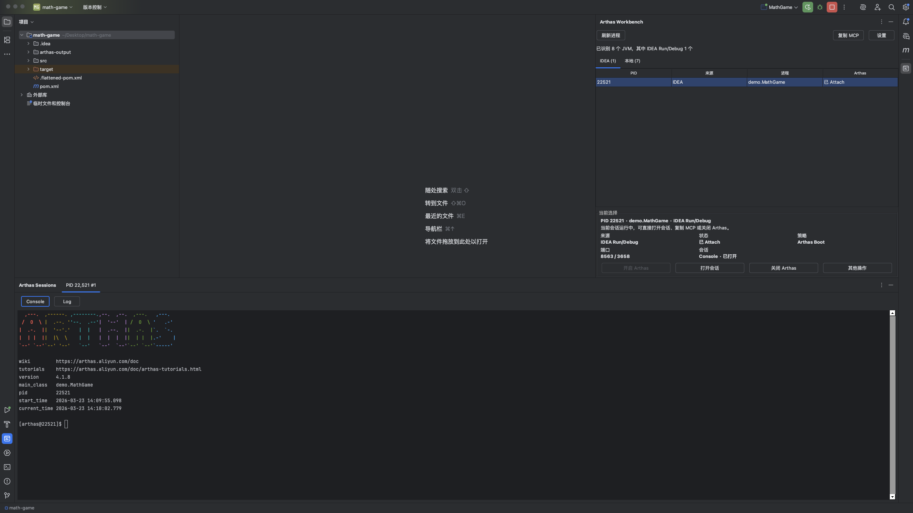
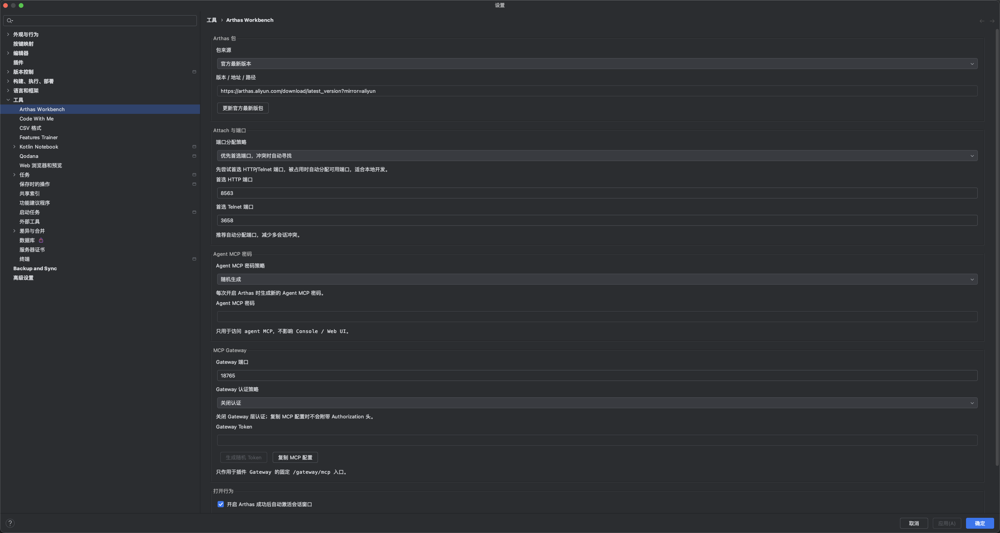
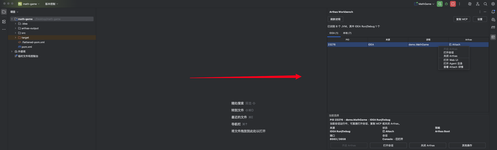
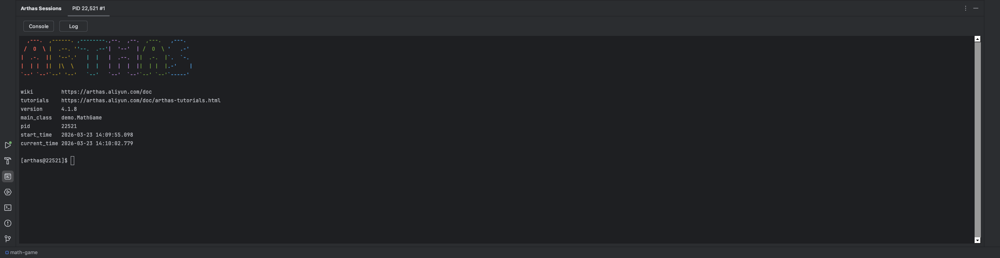
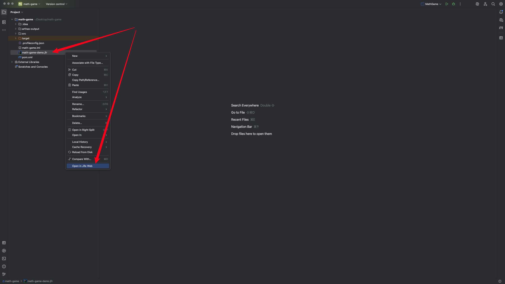
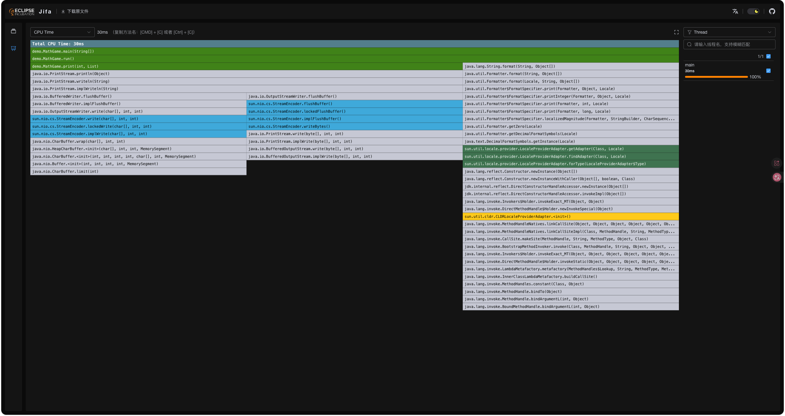
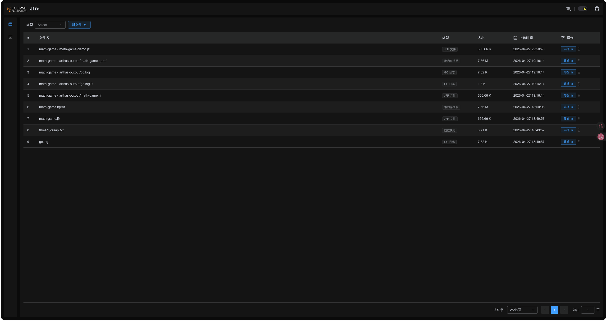

<div align="center">

# Arthas Workbench

</div>

<div align="center">
  
</div>

<div align="center">

[](https://plugins.jetbrains.com/plugin/30843-arthas-workbench)


</div>

<div align="center">

在 IntelliJ IDEA 里集中完成 Arthas 包管理、JVM 进程发现、动态 Attach、会话终端、日志查看、Jifa 文件分析和 MCP Gateway 接入。

</div>

<!-- Plugin description -->
## English:

Arthas Workbench is an IntelliJ IDEA plugin for local Arthas workflows. It helps you discover JVM processes started from IDEA Run/Debug or found on the local machine, attach Arthas with managed package sources and port allocation, manage Terminal and Log views for each session, open the Arthas Web UI in your browser, analyze JVM artifacts through a local Jifa Web service, and expose a stable MCP Gateway endpoint for AI tools or IDE assistants.

Key features:

- Discover JVM processes from both IDEA Run/Debug and the local machine.
- Attach Arthas with managed package sources, Java selection, and port allocation.
- Analyze `.jfr`, `.hprof`, GC logs, and thread dumps through Jifa Web.
- Auto-download and cache the Jifa helper jar on first use, or use an offline helper path from Settings.
- Manage Terminal and Log views for multiple sessions in dedicated tool windows.
- Open the Arthas Web UI and copy a stable MCP Gateway configuration from the IDE.

Detailed operation documents: [https://github.com/wl2027/arthas-workbench](https://github.com/wl2027/arthas-workbench)

## 中文:

Arthas Workbench 是一个面向本地 Arthas 工作流的 IntelliJ IDEA 插件。它可以帮助你发现 IDEA Run/Debug 和本机上的 JVM 进程，用一致的流程完成 Arthas Attach，在独立工具窗口里管理多会话的 Terminal / Log，并提供浏览器版 Jifa 文件分析能力与稳定的 MCP Gateway 入口，方便 AI 工具或 IDE 助手接入。

核心能力：

- 同时发现 IDEA Run/Debug 与本机 JVM 进程。
- 统一管理 Arthas 包来源、Attach Java 选择和端口分配。
- 通过 Jifa Web 分析 `.jfr`、`.hprof`、GC 日志和 thread dump。
- 首次使用时自动下载并缓存 Jifa helper jar，也支持在 Settings 中配置离线 helper 路径。
- 在独立工具窗口中管理多会话的 Terminal / Log。
- 直接打开 Arthas Web UI，并一键复制稳定的 MCP Gateway 配置。

详细操作文档: [https://github.com/wl2027/arthas-workbench](https://github.com/wl2027/arthas-workbench)

<!-- Plugin description end -->

## 项目概览

Arthas Workbench 是一个独立维护的 IntelliJ IDEA 插件开源项目，目标是把本地 JVM 调试、Arthas Attach、终端会话、日志查看、Jifa 分析和 MCP 接入收敛到一个更顺手的 IDE 工作流里。

- 仓库地址：[wl2027/arthas-workbench](https://github.com/wl2027/arthas-workbench)
- 当前版本：`0.0.6`
- 项目状态：`Alpha / 可用但持续演进`
- 目标平台：`IntelliJ IDEA Community 2025.1+`
- 开源协议：[`Apache-2.0`](LICENSE)

## 界面总览



## 核心能力

| 能力 | 说明 |
| --- | --- |
| JVM 进程发现 | 自动扫描可 Attach 的本地 JVM，并优先展示 IDEA Run/Debug 进程 |
| Arthas 包来源管理 | 统一支持官方最新版、官方指定版本、自定义远程 Zip、本地 Zip、本地目录 |
| 一键 Attach | 自动完成包解析、HTTP/Telnet 端口分配、Agent MCP 密码处理和 Attach Java 选择 |
| 多会话管理 | 在独立 `Arthas Sessions` 窗口中切换 `Terminal / Log`，并避免误关运行中会话 |
| Jifa 文件分析 | 右键打开 `.jfr`、`.hprof`、GC 日志和 thread dump，统一进入浏览器版 Jifa Web |
| MCP Gateway | 聚合多个会话的 MCP 能力，对外暴露稳定入口 `/gateway/mcp` |

## 安装

### 方式一：使用 GitHub Releases

从 [Releases](https://github.com/wl2027/arthas-workbench/releases/latest) 下载最新插件包后，在 IDEA 中执行：

`Settings/Preferences` -> `Plugins` -> `⚙` -> `Install Plugin from Disk...`

插件构建产物 `build/distributions/arthas-workbench-<version>.zip` 可以直接安装到 IDEA。

### 方式二：本地构建安装

请先确保本地 `JAVA_HOME` 指向 JDK 21，然后执行：

```bash
JAVA_HOME=$(/usr/libexec/java_home -v 21) ./gradlew buildPlugin
```

构建产物位于：

`build/distributions/*.zip`

随后在 IDEA 中使用 `Install Plugin from Disk...` 安装对应 zip 包。

## 快速开始

### 1. 配置 Arthas 与 Gateway

先打开 `Settings -> Tools -> Arthas Workbench`，确认 Arthas 包来源、端口分配策略、Agent MCP 密码和 MCP Gateway 配置。



当前支持 5 种 Arthas 包来源：

- 官方最新版本
- 官方指定版本
- 自定义远程 Zip
- 本地 `arthas-bin.zip` 文件
- 本地 `arthas-bin` 目录

默认缓存目录：

`~/.arthas-workbench-plugin/packages`

### 2. 发现进程并开启 Arthas

打开右侧 `Arthas Workbench` Tool Window，选择要 Attach 的 JVM 进程，然后执行 `开启 Arthas`、`打开会话`、`打开 Web UI` 或 `复制 MCP`。



插件会自动完成：

- Arthas 包解析或下载
- HTTP / Telnet 端口分配
- Agent MCP 密码生成或读取
- 尝试识别目标 JVM 的 `java.home` 并选择更匹配的 Attach Java

### 3. 在会话里执行命令并查看日志

Attach 成功后，使用左下角 `Arthas Sessions` Tool Window 进入对应会话。每个会话都有独立 tab，可在 `Terminal` 和 `Log` 之间切换。



## Jifa 文件分析

插件当前统一通过 `Open in Jifa Web` 打开浏览器版 Jifa 分析页，会在默认浏览器中打开本地 Jifa Web。

支持的文件类型：

- `.jfr`
- `.hprof`
- `.phd`
- GC 日志
- thread dump





### helper 获取方式

默认情况下，插件在首次真正打开 Jifa 分析时才准备 helper jar，而不是在插件打包时内置它。

运行时优先级如下：

1. Settings 中配置的 `Offline Helper Path`，或者 JVM 参数 `-Darthas.workbench.jifa.helper.path=...`
2. 工作区里手工构建出来的 `jifa/server/build/libs/jifa.jar`
3. 自动下载并缓存到 `~/.arthas-workbench-plugin/jifa/runtime/<version>/arthas-jifa-server-helper.jar`

`Offline Helper Path` 支持两种形式：

- 直接指向一个 jar 文件
- 指向一个目录，目录中包含 `arthas-jifa-server-helper.jar` 或 `jifa.jar`

这意味着在离线环境下，你只需要把 helper jar 放到本地某个目录，然后在设置页里指向它即可。

### 缓存与托管目录

Jifa 全局缓存目录位于：

- `~/.arthas-workbench-plugin/jifa/storage`
- `~/.arthas-workbench-plugin/jifa/meta`
- `~/.arthas-workbench-plugin/jifa/logs`
- `~/.arthas-workbench-plugin/jifa/runtime`

职责分别是：

- `storage`：上传文件和 Jifa 数据
- `meta`：导入索引与服务状态
- `logs`：helper 服务日志
- `runtime`：自动下载的 helper jar

同一台机器上的 IDEA 插件实例会共用一套 Jifa 服务和缓存。

### 文件托管规则

插件会自动扫描当前 IDEA 已打开项目下的 `arthas-output` 目录，并把右键选中的目标文件一并纳入托管索引。即使文件不在 `arthas-output` 目录下，只要它是可分析的本地文件，也可以直接右键 `Open in Jifa Web`，后续会继续由本地 Jifa 服务统一管理和增量同步。

## helper 发布步骤

如果你需要更新默认自动下载的 helper jar，请按下面的流程构建并上传：

1. 初始化 Jifa 子模块：

```bash
git submodule update --init --recursive
```

2. 在子模块里构建 helper：

```bash
cd jifa
./gradlew :server:bootJar --no-daemon
```

3. 构建产物位于：

`jifa/server/build/libs/jifa.jar`

4. 将这个 jar 作为发布资产上传到主仓 `arthas-workbench` 的 GitHub Release，并重命名为：

`arthas-jifa-server-helper.jar`

5. 与它一同上传插件包：

- `build/distributions/arthas-workbench-0.0.6.zip`
- `arthas-jifa-server-helper.jar`

6. 上传位置：

[wl2027/arthas-workbench Releases](https://github.com/wl2027/arthas-workbench/releases)

插件默认下载地址固定为：

`https://github.com/wl2027/arthas-workbench/releases/latest/download/arthas-jifa-server-helper.jar`

因此 latest release 中必须存在这个同名资产，自动下载才能直接生效。

## 开发与构建

### 本地运行插件

```bash
JAVA_HOME=$(/usr/libexec/java_home -v 21) ./gradlew runIde
```

### 代码格式化

```bash
JAVA_HOME=$(/usr/libexec/java_home -v 21) ./gradlew spotlessApply
JAVA_HOME=$(/usr/libexec/java_home -v 21) ./gradlew spotlessCheck
```

### 测试与打包

```bash
JAVA_HOME=$(/usr/libexec/java_home -v 21) ./gradlew test
JAVA_HOME=$(/usr/libexec/java_home -v 21) ./gradlew buildPlugin
```

当前 Gradle 生命周期约定如下：

- `runIde` 与所有 `runIde*` 任务会先执行 `spotlessApply`
- `build`、`test`、`buildPlugin`、`publishPlugin` 会先执行 `spotlessCheck`

## 仓库结构

- `src/main/java/com/alibaba/arthas/idea/workbench/model`：领域模型与枚举
- `src/main/java/com/alibaba/arthas/idea/workbench/service`：包管理、进程发现、Attach、会话状态、MCP Gateway 等服务
- `src/main/java/com/alibaba/arthas/idea/workbench/service/attach`：AttachStrategy 抽象与具体实现
- `src/main/java/com/alibaba/arthas/idea/workbench/ui`：Workbench、Sessions、Terminal 等 UI 组件
- `src/main/java/com/alibaba/arthas/idea/workbench/settings`：IDEA Settings 页面实现
- `src/main/java/com/alibaba/arthas/idea/workbench/util`：端口、文件、MCP 配置、UI 辅助工具

## 文档索引

- [架构说明](docs/ARCHITECTURE.md)
- [Jifa 集成说明](docs/JIFA.md)
- [使用说明](docs/USAGE.md)
- [开发说明](docs/DEVELOPMENT.md)
- [排障指南](docs/TROUBLESHOOTING.md)
- [路线图](docs/ROADMAP.md)
- [发布说明](docs/RELEASE.md)
- [变更日志](CHANGELOG.md)

## 许可证

本项目基于 [Apache License 2.0](LICENSE) 开源。

---

Plugin based on the [IntelliJ Platform Plugin Template][template].

[template]: https://github.com/JetBrains/intellij-platform-plugin-template
[docs:plugin-description]: https://plugins.jetbrains.com/docs/intellij/plugin-user-experience.html#plugin-description-and-presentation
