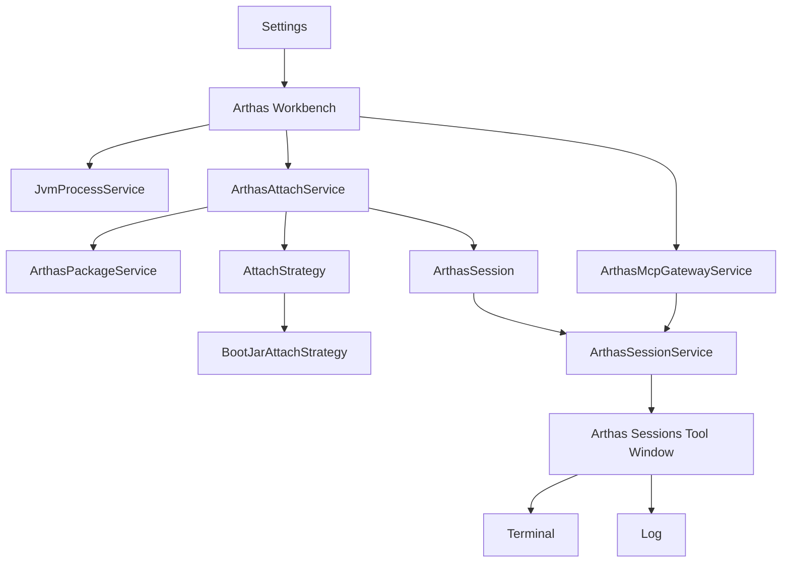

# Arthas Workbench 架构说明

## 设计目标

Arthas Workbench 当前聚焦本地开发场景，核心目标有 5 个：

1. 在 IDEA 内快速发现并选择目标 Java 进程。
2. 把 Arthas 包来源统一抽象，避免用户手工管理多种 Zip / Jar 来源。
3. 把 Attach 动作统一收敛到稳定的 `arthas-boot` 工作流。
4. 把 Terminal、Log、Web UI、MCP 的入口统一收敛到清晰的 IDE 工作流中。
5. 让 MCP 能力以稳定 Gateway 的形式暴露给 AI / IDE 内部助手使用。

## 当前 UI 分层

### Settings

全局设置只在 Settings 页面维护，不和运行期会话 UI 混在一起。

职责：

- Arthas 包来源配置及更新
- HTTP / Telnet 端口策略
- MCP Gateway 端口与认证模式
- Agent MCP 密码策略
- Attach 成功后的自动打开行为

### Arthas Workbench

Workbench 是主入口，负责进程与操作，而不是承担真正的终端渲染。

职责：

- JVM 进程发现与刷新
- 高亮 IDEA Run/Debug 进程
- 当前选中进程状态摘要
- `开启/关闭 Arthas`
- `打开 Arthas 会话`
- 当前进程的 Attach 详情、打开目录、打开 Web UI
- 复制统一 Gateway MCP
- 打开 Settings

### Arthas Sessions

Sessions Tool Window 负责一个 agent 一个 tab 的会话管理。

职责：

- 每个会话一个 tab
- tab 内切换 `Terminal / Log`
- 运行中禁止手动关闭 tab
- 停止或失败后允许点击 `x` 关闭
- 会话恢复后可以重新打开

## 当前核心抽象

### PackageSource

`PackageSourceSpec` 统一抽象 Arthas 包来源，当前支持：

- `OFFICIAL_LATEST`
- `OFFICIAL_VERSION`
- `CUSTOM_REMOTE_ZIP`
- `LOCAL_ZIP`
- `LOCAL_PATH`

对应到 Settings 页的交互约定：

- “包来源”：负责选择来源类型
- “版本 / 地址 / 路径”：根据来源类型切换成版本号、下载地址或本地路径输入
- 官方最新版本：固定显示下载地址，只读不可编辑，并提供“更新官方最新版包”按钮
- 官方指定版本：输入框提示版本号示例
- 自定义远程 Zip：输入框提示可下载链接示例
- 本地 `arthas-bin.zip` 文件：点击后直接选择文件
- 本地 `arthas-bin` 目录：点击后直接选择目录

`ArthasPackageService` 负责：

- 校验版本号、下载地址或本地路径
- 下载或解析本地包
- 解压 Zip
- 找到 `arthas-boot.jar`
- 识别 `arthas-home`
- 把结果转换为 `ResolvedArthasPackage`

默认缓存位置：

`~/.arthas-workbench-plugin/packages`

### AttachStrategy

`AttachStrategy` 是 Attach 动作的统一抽象。

当前实现：

- `BootJarAttachStrategy`

公共逻辑沉淀在 `AbstractCommandAttachStrategy`：

- 启动外部命令
- 泵出标准输出到会话日志
- 等待 HTTP 端口打开
- 统一构造失败提示
- 成功后把会话状态切到 `RUNNING`

### Session

`ArthasSession` 是不可变会话模型，保存：

- PID
- 显示名称
- HTTP / Telnet 端口
- MCP Endpoint / Password
- 包来源标签
- Attach 策略标签
- Attach Java 路径
- `arthas-boot.jar` 路径
- Arthas Home 路径
- 当前状态

### 密码与认证

Settings 中当前拆成两套独立配置：

- `Agent MCP 密码`
  只用于访问 agent 侧 MCP；IDEA 内 Terminal / Telnet 和浏览器打开的 Web UI 不依赖这里的密码
- `MCP Gateway 认证`
  只作用于插件内置 Gateway 的固定 `/gateway/mcp` 入口，不影响 Agent MCP 密码

两套配置都支持：

- `随机生成`
- `设置密码`
- `关闭认证`

其中 Gateway 的随机 Token 会持久化保存，便于复制给外部 AI 客户端长期复用。

`SessionStatus` 当前有 4 种：

- `ATTACHING`
- `RUNNING`
- `FAILED`
- `STOPPED`

### SessionService

`ArthasSessionService` 是运行期状态中心。

负责：

- 注册或更新会话
- 累积日志
- 跟踪会话窗口是否打开
- 记录当前 tab 选择的是 `Terminal` 还是 `Log`
- 根据 PID 查找最新会话
- 在进程结束时自动标记为 `STOPPED`

### MCP Gateway

`ArthasMcpGatewayService` 在插件内启动一个本地 HTTP 服务，用统一入口代理多个 Arthas agent 的 MCP 能力。

它解决了两个问题：

1. 单个 agent 的 MCP 地址随 attach 会话变化，不适合作为稳定入口。
2. 多个会话同时存在时，需要一个统一会话列表和路由入口。

当前暴露的典型入口：

- Gateway Base URL
- Sessions URL
- 固定统一 MCP 入口：`/gateway/mcp`
- 兼容调试入口：`/pid/{pid}/mcp`
- 兼容调试入口：`/session/{sessionId}/mcp`

统一 MCP 入口由网关自身实现：

- `initialize`
- `tools/list`
- `tools/call`

其中：

- `tools/list` 会额外暴露 `gateway_sessions`
- Arthas 原生工具会自动追加 `pid` / `sessionId` 两个路由参数
- 当上游 Arthas MCP 返回 `text/event-stream` 时，Gateway 会先提取其中的 JSON-RPC `data` 负载再向外返回标准 JSON
- 当仅有一个运行中的会话时，网关会自动路由
- 多会话并存时，调用方需要显式指定 `pid` 或 `sessionId`

Gateway 认证模式和 Token 在 Settings 中持久化保存。

## 当前 Terminal 架构

Terminal 使用终端链路：

- `ArthasTerminalPanel`
- `ArthasTelnetTtyConnector`
- `JediTermWidget`

工作方式：

1. attach 成功后，取会话的 Telnet 端口。
2. 通过 Telnet 连接到 Arthas Terminal。
3. 把读写流交给 JediTerm。
4. 在 IDEA 内获得接近原生终端的交互体验。

这意味着：

- 可以直接输入 Arthas 命令
- 命令补全依赖 Arthas Terminal 原生能力
- 会话切换时需要主动关闭旧连接，避免悬挂

## 当前流程图

## 当前会话生命周期

1. Workbench 刷新 JVM 列表。
2. 用户选择目标进程并点击 `开启 Arthas`。
3. `ArthasAttachService` 解析包、端口、密码和 Java 路径。
4. `AttachStrategy` 执行 attach。
5. 成功后注册 `ArthasSession` 并进入 `RUNNING`。
6. Sessions Tool Window 自动创建对应 tab。
7. 用户在 tab 内切换 `Terminal / Log`。
8. 进程退出或主动 `关闭 Arthas` 后，会话进入 `STOPPED`。
9. 停止后的 tab 允许手动关闭。

## 当前实现边界

- Web UI 为默认浏览器打开，不内嵌到插件。
- 当前能力聚焦本地 JVM，不涉及远程主机管理。
- 当前会话状态仅保存在运行期，IDE 重启后不会自动恢复。
- 当前已具备 MCP Gateway，但尚未针对不同 AI 客户端生成多套专用模板。
